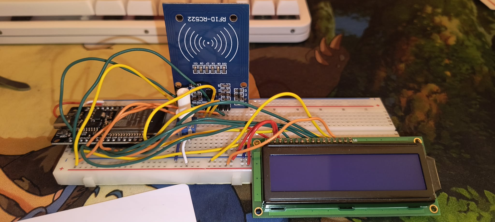
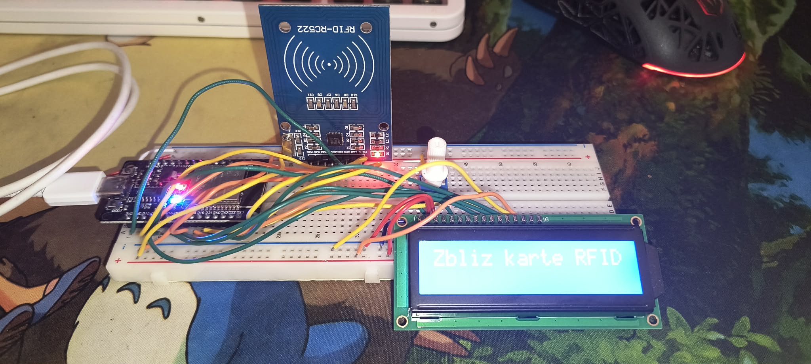
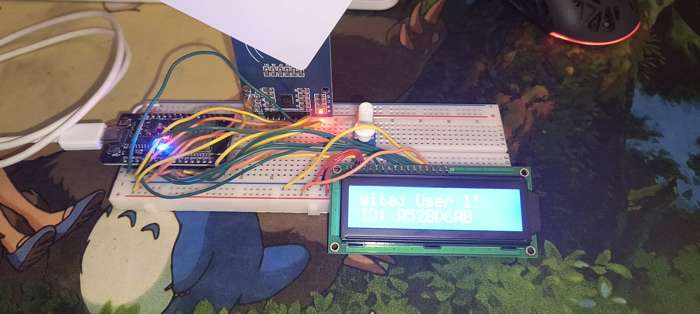
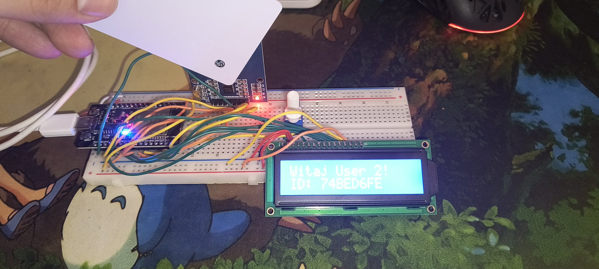

# System Kontroli Dostępu ESP32 + RFID RC522 + LCD 1602

Projekt systemu kontroli dostępu oparty na mikrokontrolerze **ESP32 (HW-394)** oraz czytniku kart **RFID RC522**. 
Kod rozpoznaje konkretne numery UID kart i wyświetla dedykowane Witaj User x , a dla nieznanych kart blokuje dostęp

### 🚀 Cechy projektu:
* **Bez konwertera I2C:** Wyświetlacz LCD 1602 jest podłączony bezpośrednio do ESP32 w trybie 4-bitowym.
* **Lewa stroma esp(Breadboard):** Kod i połączenia zostały zaprojektowane tak, aby wykorzystywać piny wyłącznie z **jednej (lewej) strony ESP32**.
* **Brak dodatkowych przewodów żeńskich:** Połączenie zasilania 5V oraz masy (GND) "pod brzuchem" ESP32 bezpośrednio do bocznych szyn zasilających płytki stykowej.

---

## 📸 Zdjęcia projektu
*(Tutaj możesz wstawić swoje zdjęcia – wystarczy, że wrzucisz je do folderu images/ i zmienisz nazwy poniżej)*

---

## 🛠️ Schemat połączeń

### Wyświetlacz LCD 1602
Wszystkie linie danych podłączone są do lewej strony ESP32, a zasilanie pobierane jest z bocznej szyny zasilającej 5V (zmostkowanej z pinu VN).

| Pin LCD | Nazwa | Podłączenie w ESP32 / Płytka |
| :---: | :--- | :--- |
| **1 & 16** | VSS / K | **GND** (Niebieska szyna) |
| **2 & 15** | VDD / A | **5V / VN** (Czerwona szyna) |
| **3** | V0 | **Środkowy pin potencjometru** (Kontrast) |
| **4** | RS | **D15** (Lewa strona) |
| **5** | R/W | **GND** (Niebieska szyna) |
| **6** | E | **D4** (Lewa strona) |
| **11-14**| D4 - D7 | **D16, D17, D21, D22** (Kolejno w rzędzie A) |

### Czytnik RFID RC522
Czytnik komunikuje się przez magistralę SPI na bezpiecznym napięciu 3.3V.

* **3.3V** -> Pin **3V3** (ESP32 lewa strona)
* **GND** -> Pin **GND** (ESP32 lewa strona)
* **SDA** -> Pin **D5**
* **SCK** -> Pin **D18**
* **MISO** -> Pin **D19**
* **MOSI** -> Pin **D23**
* **RST** -> Pin **D2**

---

## 💻 Wymagane biblioteki
w Arduino IDE:
* **MFRC522** (Zarządzanie bibliotekami -> Wyszukaj "MFRC522" -> Zainstaluj)

---
